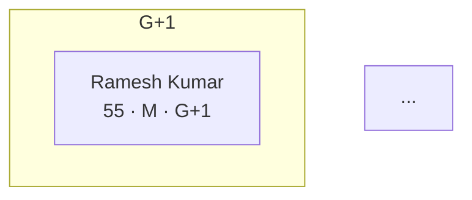

# FamScript Guide

FamScript is a declarative DSL for genealogy and human relationship diagrams. You write `.fam` files describing people and their relationships; FamScript compiles them to Mermaid diagrams, SVG, or JSON.

---

## Table of Contents

1. [Syntax Reference](#1-syntax-reference)
2. [Playground](#2-playground)
3. [Core API (any JS/TS project)](#3-core-api-any-jsts-project)
4. [React](#4-react)
5. [Vue](#5-vue)
6. [Angular](#6-angular)
7. [CLI](#7-cli)
8. [Validation Rules](#8-validation-rules)
9. [Render Options](#9-render-options)
10. [Layout Options](#10-layout-options)
11. [Plugin System](#11-plugin-system)
12. [Export Options](#12-export-options)

---

## 1. Syntax Reference

### Node format

```
ID["Name | Age | Gender | Generation"]
ID["Name | Age | Gender | Generation | Status"]
```

| Field | Values | Required |
|---|---|---|
| ID | Unique identifier | Yes |
| Name | Any string | Yes |
| Age | Number or `?` | Yes |
| Gender | `M`, `F`, or `?` | Yes |
| Generation | `G0`, `G+1`, `G+2`, `G+3`, `G-1`, `G-2` | Yes |
| Status | `deceased`, `missing`, `living`, `unknown` | No |

**Generation scale:**

| Code | Meaning |
|---|---|
| `G+3` | Great-grandparents |
| `G+2` | Grandparents |
| `G+1` | Parents |
| `G0` | Self (current generation) |
| `G-1` | Children |
| `G-2` | Grandchildren |

### Node examples

```
GROOM_SLF["Arjun Kumar | 28 | M | G0"]
BRIDE_SLF["Priya Sharma | 26 | F | G0"]
F_SLF["Ramesh Kumar | 55 | M | G+1"]
M_SLF["Sunita Kumar | 52 | F | G+1"]
GF_PAT["Ravi Das | 76 | M | G+2"]
GGF_PAT["Ram Das | 104 | M | G+3 | deceased"]
UNK_MAT["Unknown | ? | ? | G+2"]
```

### Relationship edges

| Arrow | Relationship | Use for |
|---|---|---|
| `-->` | Parent → Child | Paternal/maternal lines |
| `---` | Married to | Standard spouse pair |
| `==>` | Core couple | The primary couple of the diagram |
| `-.->` | Distant / Step / Foster | Step-parents, adopted, uncertain |

You can add an optional label:

```
F_SLF -->|"Father of"| GROOM_SLF
GF_PAT ---|"Married to"| GM_PAT
```

### Comments

```
%% This is a comment
```

### Complete example

```
%% Four-generation family tree
GGF_PAT["Ram Das | 104 | M | G+3 | deceased"]
GF_PAT["Ravi Das | 76 | M | G+2"]
GM_PAT["Kamla Das | 73 | F | G+2"]
F_SLF["Ramesh Kumar | 55 | M | G+1"]
M_SLF["Sunita Kumar | 52 | F | G+1"]
GROOM_SLF["Arjun Kumar | 28 | M | G0"]
BRIDE_SLF["Priya Sharma | 26 | F | G0"]

GGF_PAT --> GF_PAT
GF_PAT --- GM_PAT
GF_PAT --> F_SLF
F_SLF --- M_SLF
F_SLF --> GROOM_SLF
M_SLF --> GROOM_SLF
GROOM_SLF ==> BRIDE_SLF
```

---

## 2. Playground

The playground is a browser-based editor for writing and previewing FamScript in real time.

**Start it:**

```bash
pnpm install
pnpm build --filter @famscript/parser --filter @famscript/validator --filter @famscript/layout --filter @famscript/renderer-mermaid --filter @famscript/core
cd playground
npx next dev
```

Open **http://localhost:3000**.

**Features:**

- Monaco editor with FamScript syntax highlighting
- Live diagram preview (Mermaid rendered to SVG)
- Validation error panel with rule codes and messages
- **Copy Mermaid** button — copies the compiled Mermaid source
- **Export JSON** button — downloads the parsed AST as JSON
- **Reset** button — reloads the built-in sample

---

## 3. Core API (any JS/TS project)

Install the package:

```bash
pnpm add @famscript/core
# or
npm install @famscript/core
```

### One-shot compile

```ts
import { compile } from '@famscript/core'

const source = `
  F_SLF["Ramesh Kumar | 55 | M | G+1"]
  GROOM_SLF["Arjun Kumar | 28 | M | G0"]
  F_SLF --> GROOM_SLF
`

const result = compile(source)

if (result.success) {
  console.log(result.mermaid)  // Mermaid syntax string
} else {
  console.error(result.validation.errors)
}
```

### Reusable compiler instance

Use `createFamScript` when you want to share config (plugins, options) across multiple compiles:

```ts
import { createFamScript } from '@famscript/core'

const famscript = createFamScript({
  strict: false,           // render even when validation errors exist
  render: {
    direction: 'LR',       // left-to-right layout
    labelFormat: 'name-only',
  },
})

const result = famscript.compile(source)
```

### CompileResult shape

```ts
interface CompileResult {
  success: boolean          // true only when parse + validation both pass
  mermaid: string           // Mermaid syntax; empty string on hard failure
  validation: {
    valid: boolean
    errors: Array<{
      rule: string          // e.g. "V1", "V3", "PARSE"
      message: string
      nodeId?: string
    }>
  }
  ast: FamScriptAST | null  // parsed AST; null on parse failure
  layout: LayoutResult | null
}
```

### Rendering the SVG yourself

Once you have a `mermaid` string, use the Mermaid library to render it:

```ts
import mermaid from 'mermaid'
import { compile } from '@famscript/core'

mermaid.initialize({ startOnLoad: false, theme: 'dark' })

const result = compile(source)
if (result.mermaid) {
  const { svg } = await mermaid.render('my-diagram', result.mermaid)
  document.getElementById('preview')!.innerHTML = svg
}
```

---

## 4. React

Install dependencies:

```bash
pnpm add @famscript/core mermaid
```

### Basic hook

```tsx
import { useState, useEffect } from 'react'
import { compile } from '@famscript/core'
import mermaid from 'mermaid'

mermaid.initialize({ startOnLoad: false })

export function useFamScript(source: string) {
  const [svg, setSvg] = useState('')
  const [errors, setErrors] = useState<string[]>([])

  useEffect(() => {
    const result = compile(source, { strict: false })
    setErrors(result.validation.errors.map((e) => e.message))

    if (result.mermaid) {
      mermaid.render('fam-diagram', result.mermaid).then(({ svg }) => {
        setSvg(svg)
      })
    }
  }, [source])

  return { svg, errors }
}
```

### Component

```tsx
import { useFamScript } from './useFamScript'

export function FamilyDiagram({ source }: { source: string }) {
  const { svg, errors } = useFamScript(source)

  return (
    <div>
      {errors.length > 0 && (
        <ul style={{ color: 'red' }}>
          {errors.map((e, i) => <li key={i}>{e}</li>)}
        </ul>
      )}
      {svg && (
        <div dangerouslySetInnerHTML={{ __html: svg }} />
      )}
    </div>
  )
}
```

### Usage

```tsx
const source = `
  F_SLF["Ramesh Kumar | 55 | M | G+1"]
  GROOM_SLF["Arjun Kumar | 28 | M | G0"]
  F_SLF --> GROOM_SLF
`

export default function App() {
  return <FamilyDiagram source={source} />
}
```

### Next.js (App Router)

Because Monaco and Mermaid access the DOM, mark components that use them as client components and use dynamic import to skip SSR:

```tsx
// app/page.tsx
import dynamic from 'next/dynamic'

const FamilyDiagram = dynamic(() => import('../components/FamilyDiagram'), {
  ssr: false,
})

export default function Page() {
  return <FamilyDiagram source={mySource} />
}
```

---

## 5. Vue

Install dependencies:

```bash
pnpm add @famscript/core mermaid
```

### Composable

```ts
// composables/useFamScript.ts
import { ref, watchEffect } from 'vue'
import { compile } from '@famscript/core'
import mermaid from 'mermaid'

mermaid.initialize({ startOnLoad: false })

export function useFamScript(source: () => string) {
  const svg = ref('')
  const errors = ref<string[]>([])

  watchEffect(async () => {
    const result = compile(source(), { strict: false })
    errors.value = result.validation.errors.map((e) => e.message)

    if (result.mermaid) {
      const rendered = await mermaid.render('fam-diagram', result.mermaid)
      svg.value = rendered.svg
    }
  })

  return { svg, errors }
}
```

### Component

```vue
<!-- components/FamilyDiagram.vue -->
<script setup lang="ts">
import { useFamScript } from '../composables/useFamScript'

const props = defineProps<{ source: string }>()
const { svg, errors } = useFamScript(() => props.source)
</script>

<template>
  <div>
    <ul v-if="errors.length" style="color: red">
      <li v-for="(e, i) in errors" :key="i">{{ e }}</li>
    </ul>
    <div v-if="svg" v-html="svg" />
  </div>
</template>
```

### Usage

```vue
<script setup lang="ts">
import FamilyDiagram from './components/FamilyDiagram.vue'

const source = `
  F_SLF["Ramesh Kumar | 55 | M | G+1"]
  GROOM_SLF["Arjun Kumar | 28 | M | G0"]
  F_SLF --> GROOM_SLF
`
</script>

<template>
  <FamilyDiagram :source="source" />
</template>
```

---

## 6. Angular

Install dependencies:

```bash
npm install @famscript/core mermaid
```

### Service

```ts
// fam-script.service.ts
import { Injectable } from '@angular/core'
import { compile } from '@famscript/core'
import mermaid from 'mermaid'

mermaid.initialize({ startOnLoad: false })

@Injectable({ providedIn: 'root' })
export class FamScriptService {
  async render(source: string): Promise<{ svg: string; errors: string[] }> {
    const result = compile(source, { strict: false })
    const errors = result.validation.errors.map((e) => e.message)

    if (!result.mermaid) {
      return { svg: '', errors }
    }

    const { svg } = await mermaid.render('fam-diagram', result.mermaid)
    return { svg, errors }
  }
}
```

### Component

```ts
// family-diagram.component.ts
import { Component, Input, OnChanges, inject } from '@angular/core'
import { DomSanitizer, SafeHtml } from '@angular/platform-browser'
import { FamScriptService } from './fam-script.service'

@Component({
  selector: 'app-family-diagram',
  template: `
    <ul *ngIf="errors.length" style="color:red">
      <li *ngFor="let e of errors">{{ e }}</li>
    </ul>
    <div [innerHTML]="safeSvg"></div>
  `,
})
export class FamilyDiagramComponent implements OnChanges {
  @Input() source = ''

  safeSvg: SafeHtml = ''
  errors: string[] = []

  private svc = inject(FamScriptService)
  private sanitizer = inject(DomSanitizer)

  async ngOnChanges() {
    const { svg, errors } = await this.svc.render(this.source)
    this.errors = errors
    this.safeSvg = this.sanitizer.bypassSecurityTrustHtml(svg)
  }
}
```

---

## 7. CLI

Install globally or use via pnpm:

```bash
pnpm add -g @famscript/cli
# or run without installing:
npx famscript <command>
```

### Commands

**Render** — compile a `.fam` file and print Mermaid syntax:

```bash
famscript render family.fam
famscript render family.fam -o diagram.mmd
famscript render family.fam --direction LR
famscript render family.fam --no-strict        # render despite validation errors
famscript render family.fam --no-subgraphs     # flat node list without generation rows
```

**Validate** — check a `.fam` file without rendering:

```bash
famscript validate family.fam
```

**Lint** — ESLint-style output with file + line context:

```bash
famscript lint family.fam
```

**Export** — export to JSON AST (SVG/PNG/PDF require the export package):

```bash
famscript export family.fam --json
famscript export family.fam --json -o ast.json
```

**Dev** — watch mode, recompiles on every save:

```bash
famscript dev family.fam
```

### Exit codes

| Code | Meaning |
|---|---|
| `0` | Success |
| `1` | Validation or render error |
| `2` | File not found or unreadable |

---

## 8. Validation Rules

FamScript enforces these rules automatically. Errors are returned in `result.validation.errors` with a `rule` code.

| Rule | Code | Constraint |
|---|---|---|
| Age Gap | `V1` | Parent must be at least 15 years older than child |
| Spouse Parity | `V2` | Spouses must share the same generation |
| Gender Role | `V3` | Father/Groom must be `M`; Mother/Bride must be `F`; unknown uses `?` |
| Duplicate ID | `V4` | No two nodes in the same generation may share an ID |
| Circular Relation | `V5` | No person may be their own ancestor |
| Sibling Parity | `V6` | Siblings must be on the same generation level |
| In-Law Generation | `V7` | In-laws must stay on the spouse's generation |
| Cousin Parity | `V8` | Cousins must align to the same generation layer |
| Parse Error | `PARSE` | Tokenizer / parser failure |

### Running with `strict: false`

By default (`strict: true`) compilation halts on the first validation error. Set `strict: false` to render anyway and collect all errors alongside the diagram — useful for live editors and feedback UIs:

```ts
const result = compile(source, { strict: false })
// result.mermaid is populated even when result.success is false
```

### Adding custom rules

```ts
import { createFamScript } from '@famscript/core'

const famscript = createFamScript({
  plugins: [
    {
      name: 'my-rules',
      rules: [
        {
          name: 'NO_MISSING',
          validate(ast) {
            return ast.nodes
              .filter((n) => n.status === 'missing')
              .map((n) => ({
                rule: 'NO_MISSING',
                message: `Missing person in diagram: ${n.name}`,
                nodeId: n.id,
              }))
          },
        },
      ],
    },
  ],
})
```

---

## 9. Render Options

Pass a `render` object to `compile()` or `createFamScript()`:

```ts
compile(source, {
  render: {
    direction: 'TD',            // 'TD' | 'LR' | 'BT' | 'RL'  (default: 'TD')
    showGenerationSubgraphs: true,  // group nodes by generation row (default: true)
    showEdgeLabels: true,       // show "Father of", "Married to" labels (default: true)
    labelFormat: 'full',        // 'full' | 'name-only' | 'name-age'  (default: 'full')
  },
})
```

**`labelFormat` values:**

| Value | Node shows |
|---|---|
| `full` | Name, age, gender, generation, status |
| `name-only` | Name only |
| `name-age` | Name and age |

---

## 10. Layout Options

```ts
compile(source, {
  layout: {
    nodeWidth: 160,       // pixels (default: 160)
    nodeHeight: 60,       // pixels (default: 60)
    horizontalGap: 40,    // gap between nodes in the same row (default: 40)
    verticalGap: 80,      // gap between generation rows (default: 80)
    pairGap: 8,           // gap between spouses in a pair (default: 8)
  },
})
```

The layout engine guarantees:
- Same generation → same horizontal row
- Spouse nodes always placed adjacent to each other
- Older generations above, younger below
- Deterministic output — same input always produces the same layout

---

## 11. Plugin System

Plugins can add custom validation rules:

```ts
import { createFamScript } from '@famscript/core'

const famscript = createFamScript({
  plugins: [
    {
      name: 'my-plugin',
      rules: [
        {
          name: 'MAX_NODES',
          validate(ast) {
            if (ast.nodes.length > 50) {
              return [{ rule: 'MAX_NODES', message: 'Diagram exceeds 50 nodes' }]
            }
            return []
          },
        },
      ],
    },
  ],
})
```

Plugins are composable — pass multiple plugins and their rules are all applied:

```ts
createFamScript({
  plugins: [
    relationshipPlugin(),
    auditPlugin(),
  ],
})
```

---

## 12. Export Options

### JSON AST (implemented)

Get the raw AST as a JavaScript object via the API:

```ts
import { compile } from '@famscript/core'

const result = compile(source)
if (result.ast) {
  const json = JSON.stringify(
    { nodes: result.ast.nodes, edges: result.ast.edges },
    null,
    2,
  )
  console.log(json)
}
```

Or via the CLI:

```bash
famscript export family.fam --json -o ast.json
```

Or use the **Export JSON** button in the playground.

### SVG / PNG / PDF (via export package)

These formats require the `@famscript/export` package (uses Puppeteer under the hood):

```bash
famscript export family.fam --svg -o diagram.svg
famscript export family.fam --png -o diagram.png
famscript export family.fam --pdf -o diagram.pdf
```

### Mermaid source

Any compiled `result.mermaid` string can be pasted directly into:
- [mermaid.live](https://mermaid.live)
- GitHub Markdown (inside ` ```mermaid ``` ` fences)
- Notion, Confluence, GitLab — all support Mermaid natively
- Any tool that accepts Mermaid syntax

```markdown

```

---

## File Extensions

| Extension | Purpose |
|---|---|
| `.fam` | FamScript source file |
| `.famconfig` | Compiler configuration |
| `.famplugin` | Plugin definition |
| `.famcache` | Compiled cache (auto-generated) |
